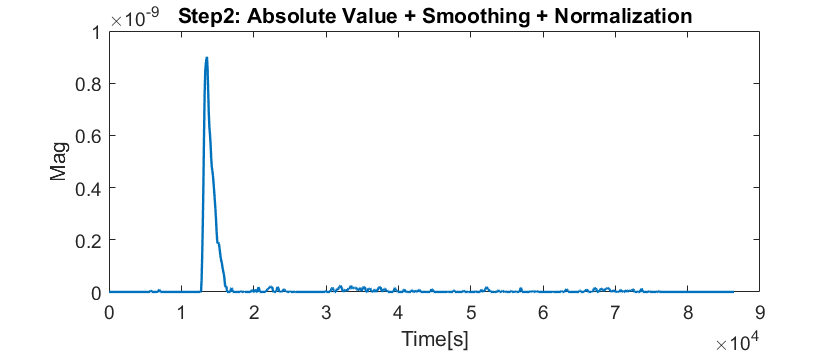

# NASA-App-Challenge

## How to run the code
You could run the main.m directly. 
Simply change which celestial body your interested seismic event is on, and make sure to give the path to the original data (must in .csv format).

Have a nice day!

## Code Description

The first part is just simple initialization. Since we're using different filter parameters to fit on data from different celestial bodies, we sould kindly ask you to check your "target body", and also tell the script where the data is. Then, you'll obtain another choice whether you would like to save the output figure. Should you want to save it, tell us where you want to save your figure.

The following parts are loading data and calculating important parameters, such as sampling time. Since we designed our algorithm on NASA provided data, only those data given by NASA Space App Challenge would be manipulated correctly.

**Step 1. Bandpass Filter**
> Target: filt noises out

In this step, we applied a bandpass filter to gather useful information hide in noisy waves. The bandwidth are decided based on gathered information and empirically modified. We take *lunar\test\data\S12_GradeB\xa.s12.00.mhz.1970-01-09HR00_evid00007.csv* for example: 
# NASA-App-Challenge

## How to run the code
You could run the main.m directly. 
Simply change which celestial body your interested seismic event is on, and make sure to give the path to the original data (must in .csv format).

Have a nice day!

## Code Description

The first part is just simple initialization. Since we're using different filter parameters to fit on data from different celestial bodies, we sould kindly ask you to check your "target body", and also tell the script where the data is. Then, you'll obtain another choice whether you would like to save the output figure. Should you want to save it, tell us where you want to save your figure.

The following parts are loading data and calculating important parameters, such as sampling time. Since we designed our algorithm on NASA provided data, only those data given by NASA Space App Challenge would be manipulated correctly.

**Step 1. Bandpass Filter**
> Target: filt noises out

In this step, we applied a bandpass filter to gather useful information hide in noisy waves. The bandwidth are decided based on gathered information and empirically modified. We take *xa.s12.00.mhz.1970-01-09HR00_evid00007.csv* for example (lunar, test, GradeB): 

*Figure 1: Original data and filtered data*

It is clearly shown that several unwanted peaks are filted. This help us preliminary exclude some noises that we are not interested in. However, the signal is still too noisy to be analyzed.

**Step 2. Envelope Generation**

In this step, we apply a series of filters to obtain those data we're interested in: 

1. Take the absolute value of the data
2. Apply **gaussian smoothing**: this is the critical step to handle those peaks that are not filted out in Step 1.
3. Normalization: since most data are scale differently, we apply a normalization for the ease of further analysis.

*Figure 2: Filtered data and information obtained from envelope generation.*

**Step 3. Envelope Detection**
1. Find the *envelops*, i.e. the intervals that exceeds a specified magnitude: this is the easiest way to seperate white noise (which often have less power) with earthquake data.
2. Find the maximum value in each interval

However, after running some cases, we noticed that there would be a type of seismic events which has two local maximums, and the latter one has greater power. Under this circumstance, our assumption might fail as the "rising time" is over estimated. Therefore, we slightly changed our algorithm for this issue: 

2. (modified) Find the local maximum which exceeds half between the specified magnitude used in step 1. and the maximum magnitude in an envelope
3. Mark the first local maximum as a alternative maximum value,

**Step 4. Peak detection**
According to our observation and theoretical results, a typical quake signal would rise immediately and full slowly, closed to exponetial decay. On the other hand, since noise happens "occasionally", they often has equitable rising and falling slope. 

Under this assumption, we detect the rising slope and falling slope of each envelope. This detection is done by following steps:

